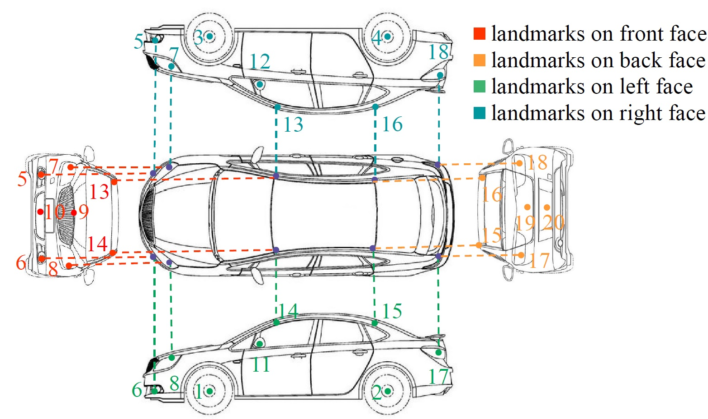

# Key Point and Vehicle Orientation Annotation for VeRi-776 dataset
====================================================================
### Introduction
[VeRi-776](https://github.com/VehicleReId/VeRidataset) is a large-scale benchmark dateset for vehicle Re-Id in the real-world urban surveillance scenario. 
It contains over 50,000 images of 776 vehicles captured by 20 cameras covering an 1.0 km^2 area in 24 hours, which makes the dataset scalable enough for vehicle Re-Id and other related research.

This repo has annotations of **key point location** and **vehicle orientation** for VeRi-776 dataset, which is used in our 
*ICCV'17* paper [Orientation Invariant Feature Embedding and Spatial Temporal Regularization for Vehicle Re-identification](http://openaccess.thecvf.com/content_ICCV_2017/papers/Wang_Orientation_Invariant_Feature_ICCV_2017_paper.pdf).

### Citation

If you find this repo useful in your research, please consider to cite:
	@InProceedings{Wang_2017_ICCV,
	author = {Wang, Zhongdao and Tang, Luming and Liu, Xihui and Yao, Zhuliang and Yi, Shuai and Shao, Jing and Yan, Junjie and Wang, Shengjin and Li, Hongsheng and Wang, Xiaogang},
	title = {Orientation Invariant Feature Embedding and Spatial Temporal Regularization for Vehicle Re-Identification},
	booktitle = {The IEEE International Conference on Computer Vision (ICCV)},
	month = {Oct},
	year = {2017}
	}

### Get VeRi-776 dataset
Please refer to [this repo](https://github.com/VehicleReId/VeRidataset).

### Key points' definition
We defined 20 key points in a vehicle, which we think are the most discriminative locations or some main vehicle components, 
for instance, wheels, lamps, auto logo and so on. You can find our definition of the 20 key points in the figure and the table bellow.



	|index|location|index|location|
	|:-:|:-:|:-:|:-:|
	|1|left-front wheel|11|left rear-view mirror|
	|2|left-back wheel |12|right rear-view mirror|
	|3|right-front wheel|13|right-front corner of vehicle top|
	|4|right-back wheel|14|left-front corner of vehicle top|
	|5|right fog lamp|15|left-back corner of vehicle top||
	|6|left fog lamp|16|right-back corner of vehicle top|
	|7|right headlight|17|left rear lamp|
	|8|left headlight|18|right rear lamp|
	|9|front auto logo|19|rear auto logo|
	|10|front license plate|20|rear license plate|

### Orientation's definition

We classify the orientation of a vehicle into 8 categories, according to which face(s) of the vehicle is visible in this view :

	0|front 
	:---:|:---:
	1|rear
	:---:|:---:
	2|left
	:---:|:---:
	3|left front
	:---:|:---:
	4|left rear
	:---:|:---:
	5|right
	:---:|:---:
	6|right front
	:---:|:---:
	7|right rear

### Annotation file format

In each line in the annotation file, the format is:
```Shell
img_path x1 y1 x2 y2 ... x20 y20 orien
```
```(x_i,y_i)``` is the location of the *i*th key point of a vehicle, and ```orien``` is the orientation label.

### Contact
Please concact Zhongdao Wang (wcd17@mails.tsinghua.edu.cn) if you have questions about the annotations.